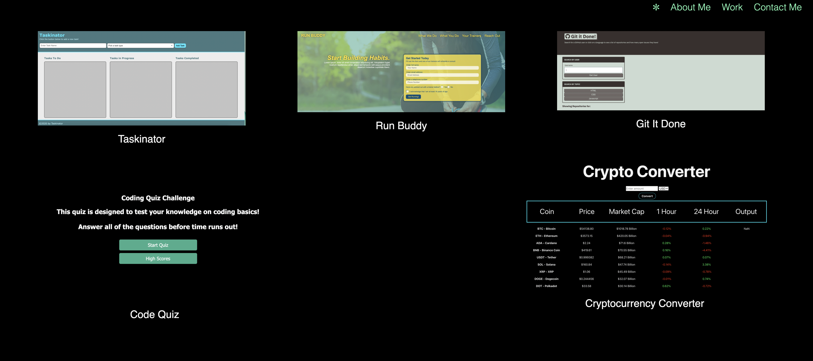

# Casey Lister's Portfolio
Using HTML and CSS, I've created my own personal portfolio! I used flexbox and media queries to make editing and viewing better across devices. Included in my webpage, you will get to learn a little bit about me and how to contact me, find a picture of myself, and see my past work. I look forward to not only adding more projects to my site, but also updating it to be more unique, creative, and immersive!

## Application Link and Screenshot
https://caseylister.github.io/My-Portfolio/

